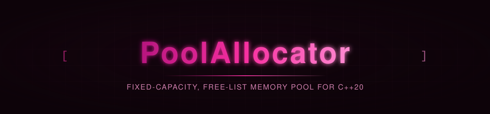

<p align="center">
  
</p>

<p align="center">
  
  
  
</p>

<p align="center">
  
</p>

<p align="center"><sub><b>CI / CD</b></sub></p>
<p align="center">
  <a href="https://github.com/privateMwb/PoolAllocator/actions/workflows/build.yml">
    
  </a>
  <a href="https://github.com/privateMwb/PoolAllocator/actions/workflows/benchmark.yml">
    
  </a>
  <a href="https://github.com/privateMwb/PoolAllocator/actions/workflows/packaging.yml">
    
  </a>
  <a href="https://github.com/privateMwb/PoolAllocator/actions/workflows/release.yml">
    
  </a>
</p>

<p align="center"><sub><b>Code Quality &amp; Safety</b></sub></p>
<p align="center">
  <a href="https://github.com/privateMwb/PoolAllocator/actions/workflows/coverage.yml">
    
  </a>
  <a href="https://github.com/privateMwb/PoolAllocator/actions/workflows/sanitizers.yml">
    
  </a>
  <a href="https://github.com/privateMwb/PoolAllocator/actions/workflows/clang-tidy.yml">
    
  </a>
  <a href="https://github.com/privateMwb/PoolAllocator/actions/workflows/clang-format.yml">
    
  </a>
  <a href="https://github.com/privateMwb/PoolAllocator/actions/workflows/codeql.yml">
    
  </a>
  <a href="https://github.com/privateMwb/PoolAllocator/actions/workflows/cflite_pr.yml">
    
  </a>
  <a href="https://www.bestpractices.dev/projects/14729">
    
  </a>
</p>

<p align="center"><sub><b>Documentation</b></sub></p>
<p align="center">
  <a href="https://github.com/privateMwb/PoolAllocator/actions/workflows/docs.yml">
    
  </a>
</p>

<p align="center">
  
</p>

<p align="center"><sub><b>Compiler Support</b></sub></p>
<p align="center">
  
  
  
  
</p>

<p align="center">
  
</p>

<p align="center">PoolAllocator is a header-only, fixed-capacity memory pool for modern C++ — O(1) <code>allocate()</code>, <code>deallocate()</code> and <code>reset()</code> through an intrusive free list and a bump-pointer watermark, in-place <code>create&lt;T&gt;()</code>/<code>destroy&lt;T&gt;()</code>, batch operations, and optional zero-overhead allocation statistics, so you only pay for the parts you actually use.</p>

<br>

## 📑 Table of Contents

- [Features](#features)
- [Requirements](#requirements)
- [Installation](#installation)
- [Quick Start](#quick-start)
- [Project Structure](#project-structure)
- [Development](#development)
- [Benchmarks](#benchmarks)
- [Fuzzing](#fuzzing)
- [Documentation](#documentation)
- [Contributing](#contributing)
- [Changelog](#changelog)
- [Security](#security)
- [License](#license)

<br>

## <a id="features"></a>✨ Features

- **Free list plus watermark, no per-block setup** — every block is in exactly one of three states: virgin (at or beyond the watermark, never written to), on the intrusive free list, or allocated. The free list is drained before the watermark is ever touched, and virgin blocks are handed out by address arithmetic alone. Construction is a single allocation, and `reset()` is a handful of stores rather than a pass over every block.
- **Batch operations** — `allocateBatch()`/`deallocateBatch()` work over a `std::span<void*>`. Batch allocation drains the free list first, then bump-allocates the remainder in a branch-free loop with no dependent loads; batch deallocation builds the new free list locally and writes it back once, and statistics are updated once per batch instead of once per block.
- **Zero-overhead optional statistics** — `Pool<true>` tracks allocation counters and peak usage through `getStats()`. A plain `Pool` carries zero bytes of statistics storage (`[[no_unique_address]]`) and compiles every bookkeeping call away, rather than paying a runtime check per operation.
- **Exception-safe `create<T>()`** — if `T`'s constructor throws, the block is handed back to the pool before the exception propagates, so no block is ever lost. That handling is compiled out entirely when `T` is nothrow-constructible.
- **Alignment-aware blocks** — any power-of-two alignment (defaulting to `alignof(std::max_align_t)`), including alignments larger than the block size; the stride is the block size rounded up to that alignment. Exhaustion is a plain bounds check and a `nullptr` return — no exceptions, no reallocation.
- **Contract-based preconditions** — `AP_PRE`/`AP_POST`/`AP_INVARIANT`/`AP_ASSERT` map to `assert()`: checked in debug builds, compiled out entirely under `NDEBUG`. Constructor preconditions run strictly before the backing allocation is attempted, so a violated precondition never reaches `::operator new` with garbage arguments.

<div align="right"><a href="#-table-of-contents"></a></div>

## <a id="requirements"></a>📋 Requirements

- A C++20-conformant compiler (tested: GCC, Clang, MSVC, AppleClang)
- CMake 3.20+

<div align="right"><a href="#-table-of-contents"></a></div>

## <a id="installation"></a>📦 Installation

**From source:**

```bash
git clone https://github.com/privateMwb/PoolAllocator.git
cd PoolAllocator
cmake -B build \
  -DBUILD_TESTS=OFF \
  -DBUILD_BENCHMARKS=OFF \
  -DBUILD_REGRESSION=OFF \
  -DBUILD_EXAMPLES=OFF
cmake --install build
```

Then, in your own `CMakeLists.txt`:

```cmake
find_package(PoolAllocator CONFIG REQUIRED)
target_link_libraries(your_target PRIVATE PoolAllocator::PoolAllocator)
```

> vcpkg and Conan packages are built and verified (recipe in
> `packaging/recipes/poolallocator/`, port in `packaging/vcpkg/ports/poolallocator/`),
> but not yet published to the public registries. This section will be
> updated once they are.

<div align="right"><a href="#-table-of-contents"></a></div>

## <a id="quick-start"></a>🚀 Quick Start

```cpp
#include <PoolPro/Pool.h>

struct Particle {
    float x, y, z;
    Particle(float x, float y, float z) : x(x), y(y), z(z) {}
};

int main() {
    // 1024 blocks, each big enough for a Particle
    PoolPro::Pool<> pool(sizeof(Particle), 1024);

    Particle* p = pool.create<Particle>(1.0f, 2.0f, 3.0f);
    if (p) { // nullptr once the pool is exhausted
        // ... use *p ...
        pool.destroy(p); // runs ~Particle(), returns the block to the pool
    }

    void* raw = pool.allocate(); // uninitialized block
    pool.deallocate(raw);

    pool.reset(); // O(1) — every block is available again
}
```

Handling many blocks in one call (`allocateBatch()` may return fewer than
requested if the pool runs out):

```cpp
PoolPro::Pool<> pool(sizeof(Particle), 1024);

std::array<void*, 64> blocks;
std::size_t got = pool.allocateBatch(blocks);

pool.deallocateBatch(std::span<void*>(blocks.data(), got));
```

Statistics and custom alignment (requires `Pool<true>`):

```cpp
PoolPro::Pool<true> pool(48, 256, 64); // 48-byte blocks, 64-byte aligned, stats on

void* a = pool.allocate();
void* b = pool.allocate();
pool.deallocate(a);

const auto& stats = pool.getStats();
std::cout << "peak used: " << stats.peakUsed_ << '\n'; // 2
std::cout << "owns b: " << pool.owns(b) << '\n';       // 1
std::cout << "stride: " << pool.blockStride() << '\n'; // 64
```

<div align="right"><a href="#-table-of-contents"></a></div>

## <a id="project-structure"></a>🗂️ Project Structure

```
PoolAllocator/
├── include/
│   └── PoolPro/
│       ├── Pool.h
│       ├── Pool.tpp
│       └── Contract.h
│
├── tests/
│   ├── custom/
│   ├── google/
│   ├── CMakeLists.txt
│   └── README.md
│
├── benchmarks/
│   ├── baselines/
│   ├── custom/
│   ├── google/
│   ├── result/
│   ├── CMakeLists.txt
│   └── README.md
│
├── examples/
│   ├── support/
│   ├── suite/
│   ├── example_main.cpp
│   ├── CMakeLists.txt
│   └── README.md
│
├── regression/
│   ├── custom/
│   ├── google/
│   ├── results/
│   ├── CMakeLists.txt
│   └── README.md
│
├── fuzz/
│   └── fuzz_pool.cpp
│
├── .clusterfuzzlite/
│   ├── Dockerfile
│   ├── build.sh
│   └── project.yaml
│
├── packaging/
│   ├── README.md
│   ├── requirements.in
│   ├── requirements.txt
│   ├── recipes/
│   ├── vcpkg/
│   └── vcpkg-smoke-test/
│
├── scripts/
│   └── update_package_files.py
│
├── .github/
│   ├── assets/
│   ├── releases/
│   ├── workflows/
│   ├── CODEOWNERS
│   └── dependabot.yml
│
├── cmake/
│   └── PoolAllocatorConfig.cmake.in
│
├── docs/
│   ├── Doxyfile
│   └── README.md
│
├── .clang-format
├── .clang-tidy
├── .gitignore
├── CMakeLists.txt
├── README.md
├── CONTRIBUTING.md
├── CHANGELOG.md
├── SECURITY.md
├── FUZZING.md
└── LICENSE
```

<div align="right"><a href="#-table-of-contents"></a></div>

## <a id="development"></a>🛠️ Development

The from-source install above builds the library only. To work on
PoolAllocator itself — running tests, benchmarks, or the regression tool —
build with everything enabled (the default):

```bash
cmake -B build
cmake --build build
```

**Run the test suite:**

```bash
ctest --test-dir build
```

**Run benchmarks and check for regressions:**

```bash
./build/benchmarks
./build/regression                  # latest baseline vs. benchmarks/results/benchmark_results.json
./build/regression v1.2.0           # a specific baseline vs. current
./build/regression v1.2.0 v1.4.0    # two baselines against each other
```

`regression` picks the latest baseline by semantic version (`v1.10.0`
correctly outranks `v1.9.0`), not alphabetical filename order, and
auto-names its output (`regression_v1.2.0_vs_current.md`/`.json`, etc.).

See [packaging/README.md](packaging/README.md) for notes on verifying the vcpkg
port and Conan recipe locally.

<div align="right"><a href="#-table-of-contents"></a></div>

## <a id="benchmarks"></a>📊 Benchmarks

Measured against `stdPool` (a naive `new`/`delete`-per-block baseline), same
build, at 10K / 100K / 1M iterations (`benchmarks/baselines/v1.0.0.json` has
the full dataset).

*Environment: Release build — see the `context` block in
`benchmarks/baselines/v1.0.0.json` for the exact machine and library
version each run was captured on.*

| Operation | PoolAllocator (1M) | stdPool (1M) | Δ |
|---|---|---|---|
| `Allocate()` at capacity | 2.19 ms | 2.50 s | +114440.3% |
| `Allocate()` large | 330.34 us | 18.01 ms | +5351.5% |
| `Allocate()` 4-byte alignment | 308.91 us | 12.12 ms | +3823.7% |
| `Reset()` + refill | 345.55 ms | 11.94 s | +3354.0% |
| `Allocate()` 10M-block pool | 395.01 us | 11.73 ms | +2869.7% |
| `Allocate()` room to spare | 663.60 us | 12.08 ms | +1720.4% |
| `Reset()` | 331.58 us | 5.55 ms | +1573.5% |
| `Create<T>()` trivial | 1.07 ms | 15.14 ms | +1312.3% |
| `Deallocate()` | 1.73 ms | 16.07 ms | +826.8% |
| `Destroy<T>()` non-trivial | 2.24 ms | 17.24 ms | +671.0% |
| Construction | 41.04 ms | 149.16 ms | +263.4% |

PoolAllocator's largest win is the exhaustion path — a bounds check and a
`nullptr` return, versus `stdPool`'s per-call heap traffic — followed by bulk
churn (`reset()` + refill) and every allocate/create/destroy/deallocate path,
where `stdPool`'s per-block `new`/`delete` overhead shows up directly.

There is no measured regression against the baseline in this suite. Even
construction, where eager upfront allocation usually costs the most, comes out
ahead, since `stdPool` pays for a burst of per-block heap allocations on first
use where PoolAllocator front-loads a single one. The real trade-off is
functional rather than measured: a pool is fixed-capacity and fixed-block-size
by design, trading the flexibility of a general-purpose allocator for the O(1)
reuse these numbers are measuring.

<div align="right"><a href="#-table-of-contents"></a></div>

## <a id="fuzzing"></a>🐛 Fuzzing

`Pool` is continuously fuzzed via
[ClusterFuzzLite](https://google.github.io/clusterfuzzlite/):
differential testing against an exact shadow model of the free list and
watermark, under AddressSanitizer and UndefinedBehaviorSanitizer, for both
`Pool<false>` and `Pool<true>`. A short pass runs on every PR touching
`Pool`'s implementation; a longer pass runs nightly.

This covers single and batch allocation and deallocation, the contract that
pointers the pool doesn't own (including another pool's blocks) are silently
ignored, `create()`'s exception path, `destroy()`, `reset()`, and move
construction/assignment including self-move — checking every returned
pointer against the one the model says must come next, and every live block's
contents after every operation. Caller-side misuse (double-frees,
use-after-free) and very large pools aren't covered, and two contract edges
are deliberately steered around — see [FUZZING.md](FUZZING.md) for full scope,
running locally, and reproducing a failing input.

<div align="right"><a href="#-table-of-contents"></a></div>

## <a id="documentation"></a>📖 Documentation

Full API reference, generated with Doxygen from `docs/Doxyfile`:

**https://privateMwb.github.io/PoolAllocator/**

<div align="right"><a href="#-table-of-contents"></a></div>

## <a id="contributing"></a>🤝 Contributing

Issues and pull requests are welcome — see [CONTRIBUTING.md](CONTRIBUTING.md)
for the full process, coding standard reference, and what CI checks on
every PR. Short version, before submitting:

- Run the test suite (`ctest --test-dir build`)
- If you're changing a hot path, run `./build/regression` and mention
  the results in your PR description

<div align="right"><a href="#-table-of-contents"></a></div>

## <a id="changelog"></a>📝 Changelog

See [CHANGELOG.md](CHANGELOG.md) for a curated, per-release summary of
changes, or the [Releases](https://github.com/privateMwb/PoolAllocator/releases)
page for the full release notes.

<div align="right"><a href="#-table-of-contents"></a></div>

## <a id="security"></a>🔒 Security

See [SECURITY.md](SECURITY.md) for the supported versions, how to report
a vulnerability (including privately, via GitHub Security Advisories),
and the disclosure timeline.

<div align="right"><a href="#-table-of-contents"></a></div>

## <a id="license"></a>📄 License

MIT — see [LICENSE](LICENSE) for details.

<p align="center">
  <sub>Built with C++20</sub>
</p>

<p align="center">
  <a href="#-table-of-contents"></a>
</p>
